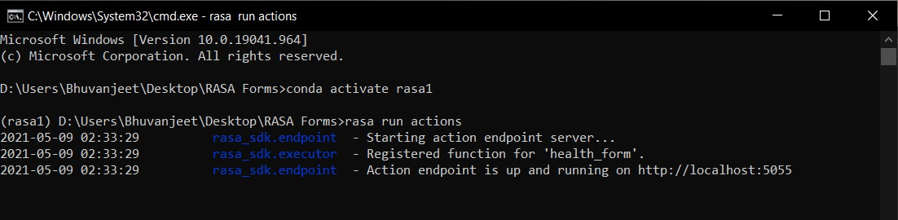
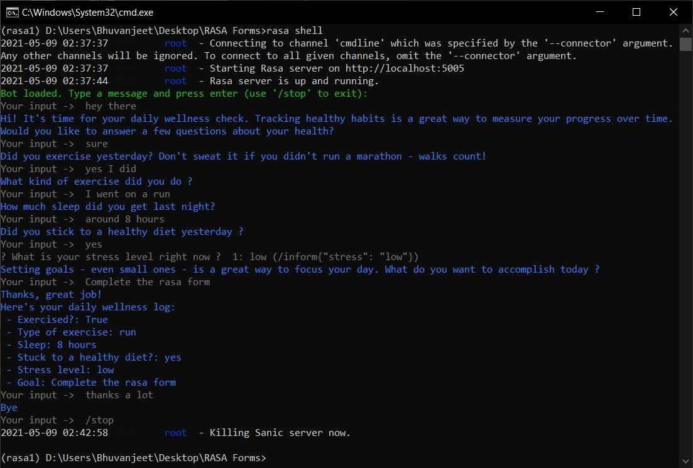

# Wellness Assistant using Rasa

Rasa has two main modules:
1. Rasa NLU for understanding user messages
2. Rasa Core for holding conversations and deciding what to do next

**Rasa NLU —** This is the place, where rasa tries to understand User messages to detect Intent and Entity in your message. Rasa NLU has different components for recognizing intents and entities, most of which have some additional dependencies.
. Spacy (You need to install it separately)
. Tensorflow (By Default available with Rasa)

**Rasa Core —** This is the place, where Rasa try to help you with contextual message flow. Based on User message, it can predict dialogue as a reply and can trigger Rasa Action Server.
Rasa internally uses Tensorflow, whenever you do “pip install rasa” or “pip install rasa-x”, by default it installs Tensorflow.

In this project, a form is made which collects a user's daily health information and saves it to an Airtable. From the data stored overtime in the Airtable, one can analyze how well one is sticking to the diet and exercise goals.

## Requirements:

1- Rasa 1.10.2

2- Anaconda(or Miniconda) - preferred.

## Setup and Project Overview:
### Rasa Forms 
#### Output in Shell:

Follow below commands to create a virtual environment named 'rasa1' in conda. This will allow you to run Rasa without errors.

conda create -n rasa1 python=3.6

conda activate rasa1

Now install rasa 1.10.2 -> pip3 install rasa==1.10.2

Since the project is already made and trained, the following commands mentioned are not required.

rasa init      #to initialize a new project.

rasa train     #to train the rasa model.

Run the following commands:

Open command prompt in the project directory:

-> rasa run actions

Open another command prompt:

-> rasa shell

Bot will be loaded in the shell as shown below:

In the above image, we can see that output is visible in the shell itself.
Now to store this output to analyze it effectively, we will connect it with Airtable which is basically a spreadsheet program.

## Connecting with Airtable
### Open the project folder - 'Connecting with Airtable' and follow through-

1. Signup and make an account on https://airtable.com

2. Download the Airtable template and generate an Airtable API token. You'll also need to locate your Table Name and Base ID, which can be found in the Airtable API docs.

3. Make a .env file in the project directory and add your Airtable API token, Base ID, and Table Name to the file, as shown below.

4. Open Command prompt –> pip install python-dotenv==0.14.0

5. -> rasa train

6. Open another command prompt -> rasa run actions

7. Return to the first terminal window and start the assistant on the command line: 

-> rasa shell

Bot will be loaded. Answer to the questions will now be saved to the Airtable.

In this way, Rasa can be connected to the Airtable to store data. In fact, we can connect Rasa with many different services. One of them is Twilio which is a communication API for text messages.
